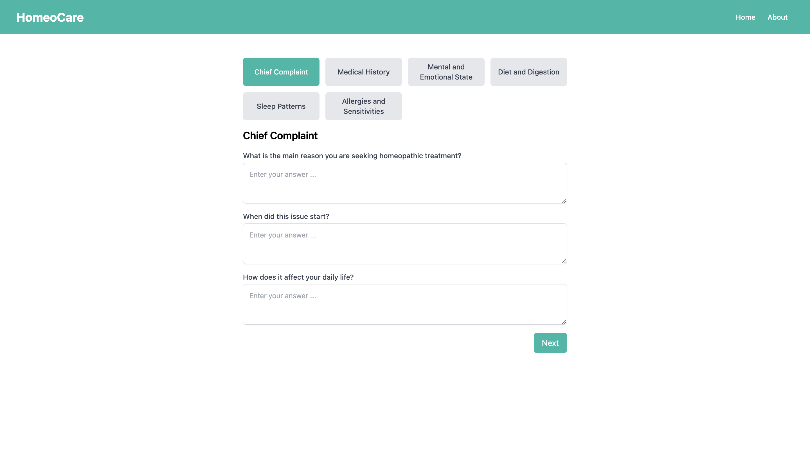

# HomeoCare - AI

## Description

HomeoCare is an application designed to provide holistic health solutions using OpenAI through homeopathic principles. It aims to assist users in finding personalized homeopathic remedies based on their symptoms and health history.

## Key Features

- **Personalized Recommendations**: Tailored homeopathic remedies based on user input.
- **Symptom Tracker**: Track and manage symptoms over time.
- **Educational Resources**: Information on homeopathic treatments and principles.
- **User-Friendly Interface**: Intuitive design for easy navigation and use.

## Installation

To install HomeoCare, follow these steps:

1. Clone the repository: `git clone https://github.com/chiragbadhe/Homeocare`
2. Install dependencies: `npm install`
3. Start the application: `npm start`

## Usage

1. **Symptom Input**: Describe your symptoms and health history to receive suggested homeopathic remedies.
2. **Explore Resources**: Learn more about homeopathy and how it can support your health journey.

## Technologies Used

- Frontend: React.js, Next.js
- Backend: Node.js, Express.js

## Contributing

Contributions are welcome! Please fork the repository and submit pull requests to propose changes.
